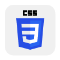
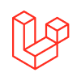
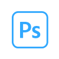
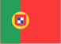

  
  <h4 align="center">  🤖 Full Stack Developer &nbsp; | &nbsp; 🎨 Graphic Designer &nbsp; | &nbsp; 📌Trento, IT</h4>

 
<ul>   
  <li>💻 My website portfolio is available at <a href="https://saracetto.netlify.app">https://saracetto.netlify.app</a>  </li>
  <li>📫 How to reach me</a><a href="https://www.linkedin.com/in/saracetto/" target="_blank" rel="noreferrer"> https://www.linkedin.com/in/saracetto/</a> </li>
  <li>🎓 Currently learning ❄ React </li>
</ul>

##### WEB DEVELOPER:
>  &nbsp;  &nbsp; &nbsp;  &nbsp;  &nbsp;  &nbsp;  &nbsp;  &nbsp;  &nbsp;  

##### GRAPHIC DESIGNER:
>      

##### GIT REPORT :octocat: :

##### SPOKEN LANGUAGES:
 *italian*  &nbsp; |  &nbsp;  *english* &nbsp; | &nbsp;  *spanish* &nbsp; | &nbsp;  *portuguese* 
 

<!--   🚀🤖📌🛸❤️💼📈 💬 :octocat: -->

<!--
| Web Developer | Graphic Design | Languages |
| :----: | :----: | :----: |
|              |        |       |
-->
